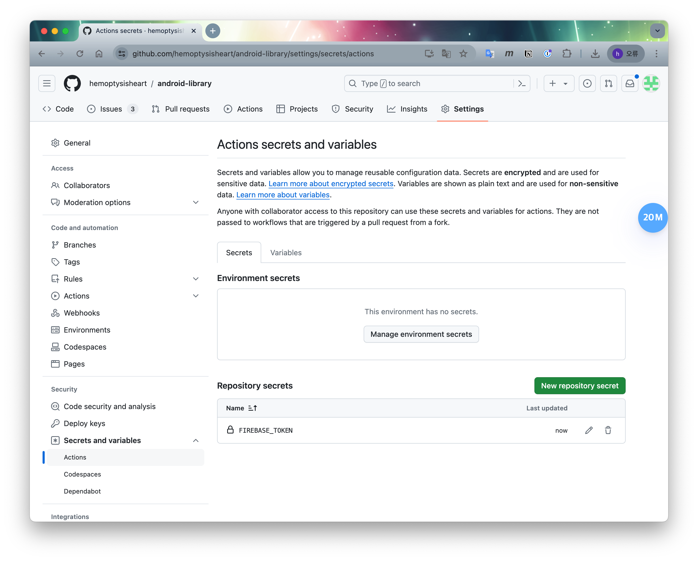

# 자동화

## CI / CD

### Firebase 연동

1. Firebase 프로젝트 생성
    - [android-library](https://console.firebase.google.com/project/android-library-2d258)
2. Firebase CLI 설치
    - `npm install -g firebase-tools`
3. GitHub Actions 용 토큰 생성.
    - `firebase login:ci` : 브라우저로 인증 후 터미널에 토큰 출력.
4. 토큰 등록
    - [Actions secrets and variables > Repository secrets](https://github.com/hemoptysisheart/android-library/settings/secrets/actions#repository-secrets)
    - 
